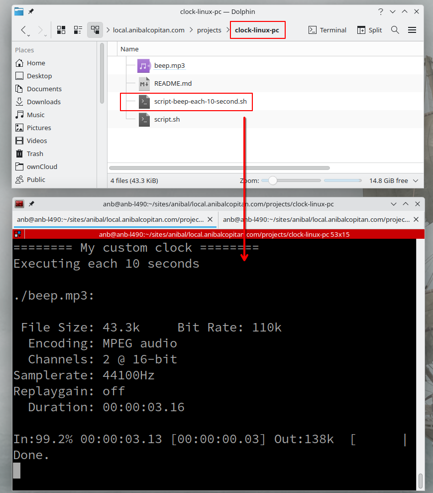

# Beep Clock 

This script is usefull for me for get attencion each hours pass

Reference: two years old ago i had a watch  that sound a beep each hours in this case. Now i dont use the watch becauses i'm unconforable with that gadget but i'm really confortable in my PC - Linux

# Requirementes

- bash
- play command

# Install in your distro linux  in my case is Arch-Linux

	sudo pacman -Sy sox
	sudo pacman -Sy libsox-fmt-mp3
	# play music.mp3
	
	
## Execute in your terminal

    chmod +x script.sh
    ./script.sh
    
## Execute or add in crontab enviroment
Ech hour or minute if you need it:

    crontab -e
    0 * * * * <path-abosolut>./script.sh ## each hour
    * * * * * <path-abosolut>./script.sh ## each minute
    
Put with log:

    0 * * * * <path-abosolute>/script.sh >> <path-abosolute>/log.txt

Explanation: (the last code run each hour)

- `0`: Runs at minute 0 (exactly at the start of each hour).
- `* * * *` Runs every hour, every day.

## Project Image

